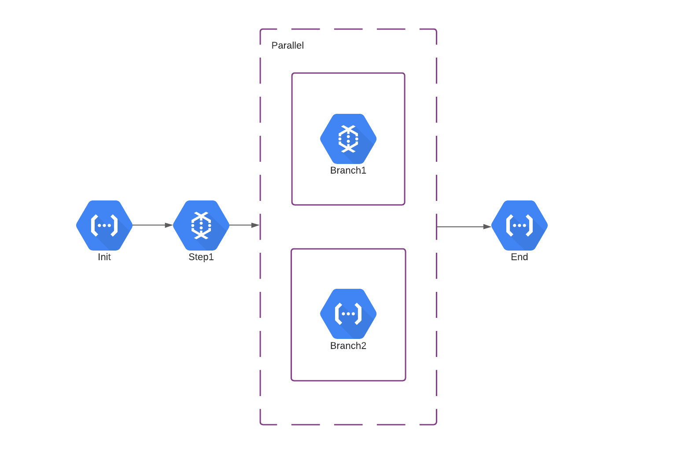

# GCP Serverless Orchestrator

A serverless framework for orchestrating GCP services in a defined flow. It can only orchestrate Cloud Functions and
Dataflow jobs at the moment, but more services will come in the future.


## High-level Concept

:pencil: **NOTE:**  
The concept is thoroughly explained in [my blog article](https://gnomezgrave.com/2020/12/04/how-to-orchestrate-dataflow-jobs-with-cloud-functions/).

This entire orchestration process is based on Cloud Logging service and the logs each service puts at the end of an
execution.

Here is a sample log line pushed to Cloud Logging when a Cloud Function is finished executing.

```json
{
  "insertId": "000000-9ed6ca06-19a5-48cc-9f29-f0605f988982",
  "labels": {
    "execution_id": "grcug3cacqj4"
  },
  "logName": "projects/ppeiris-orchestration-test/logs/cloudfunctions.googleapis.com%2Fcloud-functions",
  "receiveTimestamp": "2021-12-12T15:49:46.962297629Z",
  "resource": {
    "labels": {
      "function_name": "orch-test-1",
      "project_id": "ppeiris-orchestration-test",
      "region": "europe-west1"
    },
    "type": "cloud_function"
  },
  "severity": "DEBUG",
  "textPayload": "Function execution took 426 ms, finished with status code: 200",
  "timestamp": "2021-12-12T15:49:36.384721526Z",
  "trace": "projects/ppeiris-orchestration-test/traces/c4d487678a5270c113bbde284fc35bed"
}
```

These logs are captured by a [Cloud Logs Router](https://cloud.google.com/logging/docs/routing/overview) ([google_logging_project_sink](https://registry.terraform.io/providers/hashicorp/google/latest/docs/resources/logging_project_sink)) and they're pushed to a Cloud Pub/Sub topic, that triggers the Orchestration function. Then it identifies which job was finished and extracts the next job(s) according to
a defined flow: DAG, and automatically triggers the next. 

Here is a sample DAG.

```python
{
    "start": "Init",
    "steps": {
        "Init": {
            "type": "Task",
            "target_type": "CloudFunction",
            "target_name": "orch-test-1",
            "project_id": "ppeiris-orchestration-test",
            "region": "europe-west1",
            "next": "Step1"
        },
        "Step1": {
            "type": "Task",
            "target_type": "CloudFunction",
            "target_name": "orch-test-2",
            "project_id": "ppeiris-orchestration-test",
            "region": "europe-west1",
            "next": "Step2"
        },
        "Step2": {
            "type": "Parallel",
            "branches": [
                {
                    "start": "Branch1",
                    "steps": {
                        "Branch1": {
                            "type": "Task",
                            "target_type": "Dataflow",
                            "target_name": "word-count-demo",
                            "parameters": {
                                'input': 'gs://dataflow-samples/shakespeare/kinglear.txt',
                                'output': 'gs://wordcount_output_ppeiris/output/out',
                                'temp_location': 'gs://wordcount_output_ppeiris/temp/output',
                                'subnetwork': 'https://www.googleapis.com/compute/v1/projects/shared-vpc-x/regions/europe-west4/subnetworks/my-sub-network',
                                'setup_file': '/dataflow/template/setup.py'
                            },
                            "project_id": "ppeiris-orchestration-test",
                            "container_gcs_path": 'gs://my-flex-templates/ppeiris/python_command_spec.json',
                            "region": "europe-west4",
                            "end": True
                        }
                    }
                },
                {
                    "start": "Branch2",
                    "steps": {
                        "Branch2": {
                            "type": "Task",
                            "target_type": "CloudFunction",
                            "target_name": "orch-test-3",
                            "project_id": "ppeiris-orchestration-test",
                            "region": "europe-west1",
                            "end": True
                        }
                    }
                }
            ],
            "next": "End"
        },
        "End": {
            "type": "Task",
            "target_type": "CloudFunction",
            "target_name": "orch-test-4",
            "project_id": "ppeiris-orchestration-test",
            "region": "europe-west1",
            "end": True
        },
    }
}
```

Above DAG will create an execution plan as below.



:pencil: **NOTE:** This is just an illustration to explain the flow, and this component doesn't create such a diagram (at the moment).

According to this plan:

* It will first trigger the **Init** Cloud Function.
* After it's completed, it will then trigger the Dataflow job defined by **Step1**.
* When it's done, both the Dataflow job and the Cloud Functions respectively defined as **Branch1** and **Branch2** will
  get triggered in parallel.
* Only when both of them are completed, Cloud Function defined as **End** will get triggered.

All the intermediate states are stored as JSON files in Google Cloud Storage, and the orchestration is done using a Cloud Function (hence: "_serverless_"), so the costs are minimum.

## How to use

You need to change two main aspects of this project to make it work for you: code and terraform.

### Code Changes

* You can either directly use this repository, or you can copy the `orchestrator` directory into your source code directory for the Orchestrator Cloud Function.
* In the `main.py` of your Cloud Function, add the below code.

  ```python
  import os
  import json
  import base64
  
  from orchestrator import DAGExecutor
  from orchestration_dag_definition import OrchestrationDagDefinition
  
  
  def on_pub_sub_event(pub_sub_event, context):
      data = base64.b64decode(pub_sub_event['data']).decode('utf-8')
      data = json.loads(data)
      
      # Make sure this bucket exists and your code has read/write access.
      status_bucket_name = os.environ.get('STATUS_BUCKET', 'orchestration-status-bucket')
      
      # Creates the executor with the storage bucket, and executes it using the log line it received.
      DAGExecutor(dag_definition=OrchestrationDagDefinition.get_dag(), bucket_name=status_bucket_name).execute(data=data)
  ```
:pencil: **NOTE:**  
Make sure you have defined all the requirements you need in a `requirements.txt`, including the ones that are defined in `/code/src/requirements.txt`.


It's that simple! The `DAGExecutor` class will handle all the parsing and execution of your jobs for you!

Well, you still need to define a DAG definition as a Python `dict` for your orchestration flow as defined in [OrchestrationDagDefinition](code/src/orchestration_dag_definition.py) or as shown above, along with the complementary functions. The syntax for the DAG will be explained in a separate section. 


### Infrastructure

We use `terraform` to define our resources, and they're defined inside the `infrastructure/terraform` directory. 

* You should change the `project` variable inside the [vars.tf](infrastructure/terraform/vars.tf) as the project you're going to deploy this Orchestrator. 

* Then you can use the `make` recipe to use the official terraform Docker image.
  ```shell
  make terraform-cli
  ```

  This will (download the Docker image and) bring you to a new shell that you can use to deploy the infrastructure.

* Following commands will deploy your version of the Orchestrator to your project defined with `project` variable in `infrastructure/terraform/vars.tf`

  ```shell
  terraform init
  terraform apply --auto-approve
  ```

* If you want to deploy multiple versions of this Orchestrator, you can create separate workspaces for them, otherwise the `default` workspace will be used.

  ```shell
  terraform workspace create demo
  ```

:fire: **IMPORTANT:**

Do NOT remove the filter for the orchestration Cloud Function in the log sinks! It will create an infinite cycle of executions because the Orchestrator will react to its own execution end. Even if you want to explicitly define the Cloud Functions of interest, do NOT remove it.


Make sure you add this filter explicitly for ALL the Log Sinks you create that listens to Cloud Functions.


