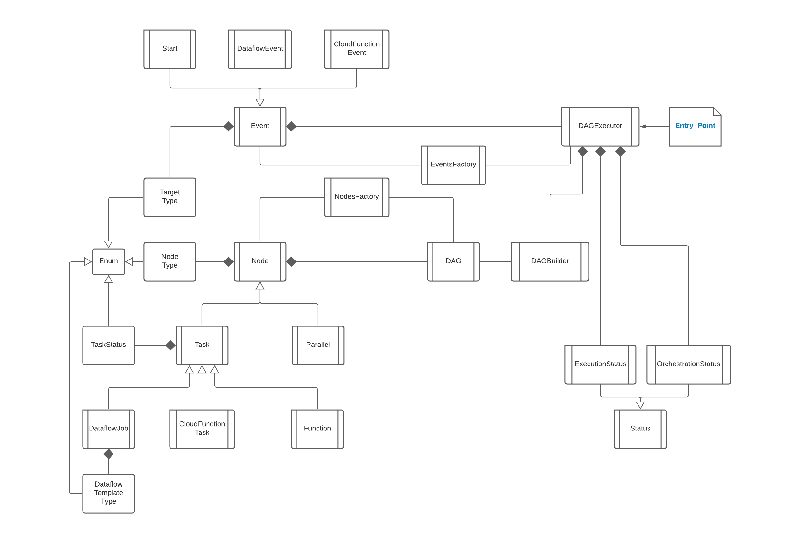

# Design

There are many classes interacting with each other to achieve this orchestration. However, the high number of classes
are only to make this component more extendable.

## Classes



## Class Responsibilities

### Event

This class defines and holds the information about the events coming from the Pub/Sub topic. This class holds some
important attributes that are needed to identify the event and the current run of the orchestration flow.

* `event_data`  
  Holds the original event as a `dict`.
* `task_name`  
  Holds the name of the Task that just finished.
* `target_type`  
  Holds the type of the Task that just finished.
* `execution_id`  
  Holds the **unique** execution ID of the Task.
* `run_id`  
  Holds the unique run ID for the orchestration run for which this Task belongs. A new run_id is generated in
  the `Start` event, and it's carried over to the other Events and Tasks.
* `status`  
  Holds the status of the Task that just finished. It's considered `NEW` by default, but need to add more logic to
  extract it from the corresponding service APIs. For instance, even if a Dataflow job gets successfully triggered, it
  might fail in the middle, and then it should be marked as `FAILED`.

There are three types of Events at the moment.

* Start  
  This special event triggers the orchestration reacting to the spacial start message: `{"resource": {"type": "start"}}`
* Dataflow Event  
  This event is instantiated with the ending message of a Dataflow job. `execution_id` will be the Job ID of the
  Dataflow job.
* Cloud Function Event  
  This event is instantiated with the ending message of a Cloud Function. `execution_id` will be the `execution_id` of
  the Cloud Function.

### Event Factory

As the name suggests, this class is a factory class that creates new Event objects using
the `create_from_event(event_data: dict)` function, that parses the event data coming from the Pub/Sub topic.

### DAG

This class holds the DAG (Directed Acyclic Graph) of Nodes that represents the orchestration flow. It has these
important attributes and methods.

* `start_node`  
  Defines the name of the starting node of this DAG.
* `parent_node`  
  Defines whether the DAG has a parent Node. If it does, it means it's a child DAG inside a Task (i.e. Parallel)
* `nodes`  
  Defines the first level child Nodes of the DAG.
* `tasks`  
  Defines the first level child Tasks out of the `nodes` that can be executed.
* `all_nodes`  
  Defines all the Nodes in the DAG and its child DAGs.
* `all_tasks`  
  Defines all the Tasks in the DAG and its child DAGS that can be executed.
* `init()`  
  This function initializes the DAG using the passed Nodes by traversing the provided `dict` of Nodes.
* `get_node_with_task(task_name: str)`  
  Returns the Task(Node) with the corresponding `task_name`.

### DAG Builder

This class is responsible for traversing the provided DAG definition (as a Python `dict`) and creating the DAG object
with Nodes and child DAGs (by calling the `build_dag()` function). We should pass OrchestrationStatus and
ExecutionStatus objects when we instantiate an object of this class that will be used to persist the statuses of the
Tasks and the entire orchestration.

### DAG Executor

This class is responsible for creating all the objects needed for the orchestration, decoding the inputs, and executing
the next Tasks according to th defined DAG. It's also responsible for detecting the statuses of the Tasks and updating
them in the Orchestration Status and Execution Status objects.

### Node

Represents a single Node in the DAG. It stores a reference to the parent DAG to make it easy to traceback. It also
stores the next Node to traverse from it. A Node can only have one next node, while it can have multiple previous nodes
because several nodes can point to the same node as their next. If a Node doesn't have a next Node, it's considered as
the end of that DAG: hence `is_end` will be true.

The `execute()` function will initiate the execution of the Node, and it should be overridden in the sub-classes.

There are two classes (at the moment) that inherit from Node.

#### Task

This defines a class that can be executed. There are several important attributes in this class.

* `target_name`  
  The name of the task to be triggered.
* `parameters`  
  Set of parameters that should be passed to the task.
* `function` (not used at the moment)  
  This defines a supplementary Python function to be triggered that should be triggered when executing the task.
* `target_type`    
  This is an enum instance to denote the type of the Task.
* `status`  
  This represents the execution status of the Task.

There are three main types of Tasks, but only two of them are currently implemented.

* Dataflow Job  
  This represents a Dataflow job and is responsible for executing it.
* Cloud Function  
  This represents a Cloud Function and is responsible for executing it.

#### Parallel

This class represents parallel executions of Tasks. It can have one or more `branches`, and each of these branches are
DAGs. The `execute()` function will trigger the `start` Nodes of each branch (aka. children DAGs).

### Node Factory

This is a factory class to create Nodes depending on the DAG definition. The `create_node(step: dict, parent_dag: DAG)`
function checks the `type` in the definition, creates a Node, and return it.

### Status

This class (and its sub-classes) is used to save the current status of the orchestration on a storage service (i.e.
Google Cloud Storage). This base class only has two basic functions for reading and writing a file to GCS. The other
functionalities are implemented in the sub-classes.

#### Execution Status

Whenever a Task is executed, it generates a unique `execution_id`. It's the job ID for a Dataflow job, execution ID for
a Cloud Function, and we have to decide one for other Task types. Then the Execution Status class will save information
about this execution along with the `run_id` that was generated by the **Start** event, and it will be written into a file
with the name format _execution_id.json_. So when that task is completed and the corresponding log line is written, the
orchestrator can read this file using the `execution_id` on the event itself. With this approach, the `run_id` for the
orchestration is shared between the Nodes within the flow, and enables us to run multiple orchestrations at the same
time without intervening with each other.

Here is a sample execution file:

```json
{
  "execution_id": "0rjdpcwx9pf5",
  "task_name": "orch-test-5",
  "node_name": "Branch2",
  "succeeded": true,
  "response": "{\"test\":\"hello\"}\n",
  "run_id": "run_1639322384"
}
```

This class only has two main functions at the moment:

* `get_execution(execution_id: str)`
  Reads the file name with the given `execution_id` inside the executions prefix (directory).
* `save_execution(execution: dict)`  
  Saves the given execution inside the executions prefix (directory) with the file name obtained
  by `execution['execution_id'']`.

This class also has the potential to be used for sending information between Tasks, by simply writing the intended data
in this execution file, but it's for the future development.

#### Orchestration Status

This class holds and manages a single run of the orchestration using the `run_id`. It creates and maintains a JOSN file
named with the format _run_id.json_ inside the `runs` prefix (directory) in the storage, and it holds the current status
of all the Tasks in the DAG.

Each entry of that JSON file contains below information respectively for **Task** and **Parallel** nodes:

```json
{
  "Init": {
    "node_name": "Init",
    "node_type": "Task",
    "next": "Step1",
    "target_type": "CloudFunction",
    "target_name": "orch-test-1",
    "status": "Completed"
  },
  ...
  "Step3": {
    "node_name": "Step3",
    "node_type": "Parallel",
    "next": "Int",
    "branches": [
      {
        "start": "Branch1"
      },
      {
        "start": "Branch2"
      }
    ]
  }
}
```

Status of each Node is updated whenever the orchestrator receives an **Event**, and that helps us to determine whether the orchestration flow is finished for a given `run_id`.

### Enums

We have several enums defined to make things easy for us.

* `NodeTypes`  
  Defines the type of the Node in the DAG
* `TargetTypes`  
  Defines the type of the target (Task) for a Task.
* `TaskStatus`  
  Defines the current status of a given Task.
* `DataflowTemplateType`  
  Defines the type of the Dataflow job depending on the type of template it uses: Classic templates or Flex templates.